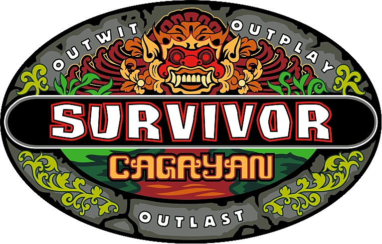

# survivor-chat

<p float="left">
    
</p>

- Synchronous video-watching and chat app platform for Luke's PSYC53 class.
- Stimuli: Survivor (Season 28)

## Tech Stack

- Firebase (<https://firebase.google.com>) - for database & hosting
- Svelte (<https://svelte.dev>) - for frontend framework
- TailwindCSS (<https://tailwindcss.com>) - for styling

## Development & Deployment

1. Clone this repo onto your computer.

```bash
git clone https://github.com/cosanlab/survivor-chat.git
```

2. Install the dependencies using npm commands made accessible by Node.js.

```bash
npm install
```

3. Run the task in dev mode - this should allow you to navigate to <http://localhost:3000> in a web browser to view the app.

```bash
npm run dev
```

4. To run in production mode, you will need to build the client in production mode.

```bash
npm run build
```